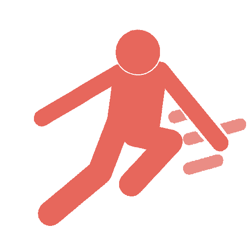

<br>
# Physics Platformer
<i>Physics-based platformer movement — run, jump, wall-slide, and interact using the built-in Physics behavior.</i> <br>
### Version 1.4.0.0

[](https://github.com/SalmanShhh/C3Addon_platformer_physics/releases/download/salmanshh_platformer_physics-1.4.0.0.c3addon/salmanshh_platformer_physics-1.4.0.0.c3addon)
<br>
<sub> [See all releases](https://github.com/SalmanShhh/C3Addon_platformer_physics/releases) </sub> <br>

#### What's New in 1.4.0.0
- **Added:** - Adds animation-mode.
- **Added:** - knockback conditions/expressions.
- **Added:** - improve robustness of floor/wall detection across collision shapes.
- **Added:** - Debugger properties are editable.
- **Added:** - ACE to overwrite whether character is "on the Floor" (Grounded)

<sub>[View full changelog](#changelog)</sub>

---
<b><u>Author:</u></b> SalmanShh <br>
<sub>Made using [CAW](https://marketplace.visualstudio.com/items?itemName=skymen.caw) </sub><br>

## Table of Contents
- [Usage](#usage)
- [Examples Files](#examples-files)
- [Properties](#properties)
- [Actions](#actions)
- [Conditions](#conditions)
- [Expressions](#expressions)
---
## Usage
To build the addon, run the following commands:

```
npm i
npm run build
```

To run the dev server, run

```
npm i
npm run dev
```

## Examples Files

---
## Properties
| Property Name | Description | Type |
| --- | --- | --- |
| Max Speed | Maximum horizontal movement speed in px/s. | float |
| Acceleration | Rate at which horizontal velocity increases toward Max Speed (px/s²). | float |
| Deceleration | Rate at which horizontal velocity decreases to zero when no input is given (px/s²). | float |
| Jump Strength | Upward impulse magnitude applied when a jump executes (px/s). | float |
| Gravity | Additional downward acceleration (px/s²) applied per tick on top of Physics world gravity. | float |
| Max Fall Speed | Terminal velocity clamp (px/s downward). | float |
| Slope Tolerance | Contact classification threshold as a fraction of half-height below center to count as floor. | float |
| Coyote Time | Seconds after leaving a floor edge during which a jump is still allowed. | float |
| Jump Buffer | Seconds a jump input is remembered before landing. | float |
| Max Jumps | Total jumps allowed per airborne period. 1 = single jump, 2 = double jump. | integer |
| Wall Slide | Clamp fall speed to Wall Slide Speed when pressing into a wall while airborne. | check |
| Wall Slide Speed | Maximum downward speed (px/s) while wall sliding. | float |
| Wall Jump | Allow jumping off a wall. | check |
| Wall Jump Strength | Horizontal impulse component of a wall jump. | float |
| Variable Jump Height | Hold the jump button for a higher jump, release it early for a shorter one. | check |
| Debug Mode | Print contact classification and velocity state to the browser console each tick. | check |


---
## Actions
| Action | Description | Params
| --- | --- | --- |
| Set acceleration | Change how quickly the character speeds up. | Acceleration             *(number)* <br> |
| Set deceleration | Override Deceleration at runtime. | Deceleration             *(number)* <br> |
| Set gravity | Override the additional downward gravity (px/s²) at runtime. | Gravity             *(number)* <br> |
| Set jump strength | Change how high the character jumps. | Strength             *(number)* <br> |
| Set max fall speed | Change the maximum fall speed the character can reach. | Speed             *(number)* <br> |
| Set max speed | Change the top running speed. | Speed             *(number)* <br> |
| Reset jumps | Give back all jumps as if the character just landed. |  |
| Set jump release damping | Set the percentage of upward velocity retained when the jump button is released early. Lower values give more control over jump height. | Damping %             *(number)* <br> |
| Set max jumps | Set how many times the character can jump before landing. | Count             *(number)* <br> |
| Set wall jump | Toggle the ability to jump off walls. | Enabled             *(boolean)* <br> |
| Set wall slide | Toggle the ability to slide down walls. | Enabled             *(boolean)* <br> |
| Apply impulse | Add an instantaneous velocity impulse to the current Physics velocity. The behavior's deceleration will naturally taper it off. | Vector X             *(number)* <br>Vector Y             *(number)* <br> |
| Apply knockback | Set the velocity and suppress all movement input for the given duration. Gravity, wall slide, and max fall speed still apply during knockback. | Vector X             *(number)* <br>Vector Y             *(number)* <br>Duration             *(number)* <br> |
| Set enabled | Fully enable or disable the behavior. | Enabled             *(boolean)* <br> |
| Set freeze axis | Lock an axis so the character cannot move on it. | Axis             *(combo)* <br>Freeze             *(boolean)* <br> |
| Set ignore input | When true, all input is ignored until re-enabled. | Ignore             *(boolean)* <br> |
| Set on floor | Override the floor contact state for this tick. Useful for moving platforms or custom collision logic. Setting true also resets jumps remaining and clears coyote/air timers as if the character just landed. | On floor             *(boolean)* <br> |
| Set vector | Set horizontal and vertical speed in px/s. | Vector X             *(number)* <br>Vector Y             *(number)* <br> |
| Set vector X | Directly set the horizontal Physics velocity (px/s). | Vector X             *(number)* <br> |
| Set vector Y | Directly set the vertical Physics velocity (px/s). | Vector Y             *(number)* <br> |
| Simulate control | Tell the behavior to act as if the player pressed a movement key this tick. Use 'Left' and 'Right' every tick the button is held. Use 'Jump' on the frame the button is pressed and 'Jump release' on the frame it is released. | Control             *(combo)* <br> |
| Stop | Instantly stop all movement. |  |


---
## Conditions
| Condition | Description | Params
| --- | --- | --- |
| Can jump | Check if the character is able to jump right now. |  |
| Compare speed | Compare the character's current speed to a value. | Comparison *(combo)* <br>Speed *(number)* <br> |
| Compare vector X | Compare the current X velocity component against a value. | Comparison *(combo)* <br>Vector X *(number)* <br> |
| Compare vector Y | Compare the current Y velocity component against a value. Positive = downward. | Comparison *(combo)* <br>Vector Y *(number)* <br> |
| Is Movement Ability enabled | Check if a specific platformer ability is currently enabled. | Ability *(combo)* <br> |
| Compare animation mode | Check the current animation mode. | Mode *(combo)* <br> |
| Is axis frozen | Check if an axis is currently frozen. | Axis *(combo)* <br> |
| Is enabled | Check if the behavior is currently active. |  |
| Is facing right | Check if the character is facing right. Invert for facing left. |  |
| Is falling | Check if the character is falling through the air. |  |
| Is ignoring input | Check if input is currently being ignored. |  |
| Is in knockback | Check if the character is currently in a knockback state (input suppressed by a knockback call). |  |
| Is jumping | Check if the character is currently moving upward from a jump. |  |
| Is moving | Check if the character is moving at all. |  |
| Is on ceiling | Check if the character is touching a ceiling. |  |
| Is on floor | Check if the character is standing on the ground. |  |
| Is on wall | Check if the character is touching a wall. | Side *(combo)* <br> |
| Is wall sliding | Check if the character is sliding down a wall. |  |
| On double jumped | Triggered when the character uses an extra mid-air jump. |  |
| On facing changed | Triggered when the character turns around. |  |
| On fallen off | Triggered when the character walks off a ledge. |  |
| On jumped | Triggered every time the character jumps. |  |
| On landed | Triggered when the character touches the ground after being in the air. |  |
| On wall jumped | Triggered when the character jumps off a wall. |  |


---
## Expressions
| Expression | Description | Return Type | Params
| --- | --- | --- | --- |
| Acceleration | Current Acceleration setting (px/s²). | number |  | 
| AirTime | Seconds the character has been in the air. 0 on the ground. | number |  | 
| AnimMode | Current animation mode string: "Idle", "Moving", "Jumping", "Falling", "Wall sliding", or "Disabled". | string |  | 
| Deceleration | Current Deceleration setting (px/s²). | number |  | 
| FacingDirection | Current facing as a signed number: -1 = left, 1 = right. | number |  | 
| Gravity | Current additional gravity setting (px/s²). | number |  | 
| JumpsRemaining | How many jumps the character has left before landing. | number |  | 
| JumpStrength | Current Jump Strength setting. | number |  | 
| MaxFallSpeed | Current Max Fall Speed setting (px/s). | number |  | 
| MaxSpeed | Current Max Speed setting (px/s). | number |  | 
| MovingAngle | The angle the character is moving in degrees. | number |  | 
| Speed | Current movement speed in px/s (magnitude of velocity vector). | number |  | 
| VectorX | Current horizontal Physics velocity (px/s). Positive = right. | number |  | 
| VectorY | Current vertical Physics velocity (px/s). Positive = down. | number |  | 
| WallContactSide | Side of the most recent wall contact: -1 = left wall, 1 = right wall, 0 = no wall. | number |  | 


---
## Changelog

**1.4.0.0**
- **Added:** - Adds animation-mode.
- **Added:** - knockback conditions/expressions.
- **Added:** - improve robustness of floor/wall detection across collision shapes.
- **Added:** - Debugger properties are editable.
- **Added:** - ACE to overwrite whether character is "on the Floor" (Grounded)

**1.3.0.0**
- **Added:** - Add Scripting Support
- **Added:** - Debugger support, shows same properties as the built-in Platform Movement Behavior.

**1.2.0.0**
- **Added:** Introduce a public scripting API  This change centralizes buff/stat logic for easier maintenance and enables direct use from C3 JS Scripting + Update Guide accordingly.

**1.1.0.1**

**1.1.0.0**
- **Added:** Initial feature spec for the Addon.

**0.0.0.0**
- **Added:** Initial release.
